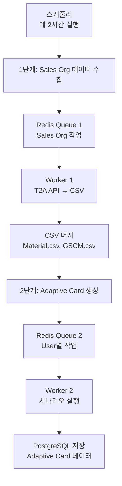

# 🚀 Adaptive Card Data Pipeline

ERP 시스템 사용자를 위한 Adaptive Card 서비스를 위한 **2단계 큐 시스템**입니다. 매 2시간마다 Sales Organization 데이터를 조회하여 각 사용자별 Adaptive Card 데이터를 미리 생성하고 저장합니다.

## 📋 목차

- [아키텍처](#-아키텍처)
- [빠른 시작](#-빠른-시작)
- [설정](#-설정)
- [사용법](#-사용법)
- [모니터링](#-모니터링)
- [개발 가이드](#-개발-가이드)

## 🏗️ 아키텍처

### 2단계 파이프라인



### 핵심 컴포넌트

- **Redis Stream**: Consumer Group 기반 메시지 큐
- **PostgreSQL**: Adaptive Card 데이터 저장소
- **스케줄러**: APScheduler 기반 자동 실행
- **워커**: 병렬 처리 가능한 데이터 처리 엔진

## 🚀 빠른 시작

### 1. 환경 설정

```bash
# PostgreSQL 설치 및 시작 (macOS)
brew install postgresql@15
brew services start postgresql@15

# Redis 설치 및 시작 (macOS)
brew install redis
brew services start redis

# 데이터베이스 생성
createdb adaptive_card_db
```

### 2. 애플리케이션 실행

```bash
# 연결 테스트
python test_overall.py

# 수평 확장 파이프라인 실행 (권장)
./start_scalable.sh

# 또는 기본 파이프라인 실행
python -m app.scheduler
```

### 3. Docker 실행 (선택사항)

```bash
# Docker Compose로 실행
docker-compose -f docker-compose.full.yml up --build
```

## ⚙️ 설정

### 환경변수

| 변수명 | 기본값 | 설명 |
|--------|--------|------|
| `MAX_WORKERS_SALES` | `3` | Sales Org 워커 수 |
| `MAX_WORKERS_ADAPTIVE` | `3` | Adaptive Card 워커 수 |
| `CRON_SPEC` | `0 */2 * * *` | 실행 주기 (2시간마다) |
| `REDIS_URL` | `redis://localhost:6379/0` | Redis 연결 URL |
| `DB_HOST` | `localhost` | PostgreSQL 호스트 |
| `DB_PORT` | `5432` | PostgreSQL 포트 |
| `DB_NAME` | `adaptive_card_db` | 데이터베이스 이름 |
| `T2A_API_URL` | `https://api.t2a.example.com` | T2A API URL |

### 워커 스케일링

```bash
# 5개 워커로 스케일링
MAX_WORKERS_SALES=5 MAX_WORKERS_ADAPTIVE=5 ./start_scalable.sh

# 환경변수로 설정
export MAX_WORKERS_SALES=10
export MAX_WORKERS_ADAPTIVE=10
./start_scalable.sh
```

## 📖 사용법

### 스케줄러 실행

```bash
# 기본 스케줄러 (단일 워커)
python -m app.scheduler

# 수평 확장 스케줄러 (권장)
python -m app.scalable_scheduler
```

### 워커 개별 실행

```bash
# Sales Org 워커
python -m app.worker_sales_org

# Adaptive Card 워커
python -m app.worker_adaptive_card
```

### 테스트 도구

```bash
python test_overall.py

# 메뉴 옵션:
# 1. 큐 상태 확인
# 2. 큐 초기화
# 3. 파이프라인 테스트
# 4. 모니터링 (2분)
# 5. 워커 테스트
```

## 📊 모니터링

### 큐 상태 확인

```bash
# 실시간 모니터링
python test_overall.py
# 옵션 4 선택

# 또는 직접 확인
python -c "
from app.stream_monitor import StreamMonitor
from app import config
import redis

r = redis.from_url(config.REDIS_URL, decode_responses=True)
monitor = StreamMonitor(r)
status = monitor.get_pipeline_status(
    config.SALES_ORG_QUEUE, config.SALES_ORG_GROUP,
    config.ADAPTIVE_CARD_QUEUE, config.ADAPTIVE_CARD_GROUP
)
print(f'Pipeline Status: {status[\"pipeline_status\"]}')
"
```

### Redis 명령어

```bash
# 큐 길이 확인
redis-cli XLEN sales_org_queue
redis-cli XLEN adaptive_card_queue

# Pending 메시지 확인
redis-cli XPENDING sales_org_queue sales_org_group
redis-cli XPENDING adaptive_card_queue adaptive_card_group

# Consumer 정보 확인
redis-cli XINFO CONSUMERS sales_org_queue sales_org_group
```

### 로그 모니터링

```bash
# 실시간 로그 확인
tail -f logs/scheduler.log

# 특정 워커 로그 필터링
grep "worker-1" logs/worker.log
```

## 🔧 개발 가이드

### 프로젝트 구조

```
Data_Engineering/
├── app/                          # 애플리케이션 코드
│   ├── scheduler.py              # 기본 스케줄러
│   ├── scalable_scheduler.py     # 수평 확장 스케줄러 (권장)
│   ├── worker_sales_org.py       # Sales Org 데이터 처리
│   ├── worker_adaptive_card.py   # Adaptive Card 생성
│   ├── retry_handler.py          # 재시도 로직 및 Dead Letter Queue
│   ├── stream_monitor.py         # Redis Stream 모니터링
│   └── config.py                 # 설정 관리
├── src/                          # 비즈니스 로직
│   ├── analysis_main.py          # 분석 엔진
│   ├── scenario_preprocessor.py  # 시나리오 전처리
│   └── action_registry.py        # 액션 레지스트리
├── test_overall.py               # 테스트 도구
├── start_scalable.sh             # 스케일링 실행 스크립트
└── README.md
```

### 핵심 기능

#### 1. Redis Stream 관리
- **Consumer Group**: 로드 밸런싱
- **ACK 기반**: 안정적인 메시지 처리
- **Dead Letter Queue**: 실패한 메시지 관리

#### 2. 재시도 로직
- **지수 백오프**: 점진적 재시도 간격
- **최대 재시도**: 3회 시도 후 DLQ 이동
- **자동 복구**: 일시적 오류 자동 처리

#### 3. 수평 확장
- **병렬 워커**: 여러 인스턴스 동시 실행
- **동적 스케일링**: 환경변수로 워커 수 조정
- **리소스 관리**: ThreadPoolExecutor 기반

### 새로운 워커 추가

```python
# app/worker_template.py
import os, sys, logging, redis, socket
from pathlib import Path

PROJECT_ROOT = os.path.abspath(os.path.join(os.path.dirname(__file__), ".."))
sys.path.append(PROJECT_ROOT)

from app import config
from app.retry_handler import RetryHandler, retry_on_failure

# 로깅 설정
logging.basicConfig(level=logging.INFO, format="%(asctime)s %(levelname)s %(message)s")
log = logging.getLogger("worker_template")

# Redis 연결
r = redis.from_url(config.REDIS_URL, decode_responses=True)
STREAM = "your_queue_name"
GROUP = "your_group_name"
WORKER_NAME = os.getenv("WORKER_NAME", f"template_worker-{socket.gethostname()}-{os.getpid()}")
CONSUMER = WORKER_NAME

# 재시도 핸들러
retry_handler = RetryHandler(r, STREAM, GROUP, CONSUMER)

def ensure_group():
    try:
        r.xgroup_create(STREAM, GROUP, id="0", mkstream=True)
        log.info(f"[{WORKER_NAME}] XGROUP CREATE {STREAM} {GROUP}")
    except redis.exceptions.ResponseError as e:
        if "BUSYGROUP" not in str(e):
            raise

@retry_on_failure(max_retries=3, base_delay=1.0)
def _process_data(data):
    """데이터 처리 로직"""
    log.info(f"[{WORKER_NAME}] Processing data={data}")
    # 여기에 실제 처리 로직 추가
    log.info(f"[{WORKER_NAME}] Completed data={data}")

def handle_message(message_id, fields):
    """메시지 처리"""
    data = fields.get("data")
    
    success = retry_handler.process_with_retry(
        message_id=message_id,
        fields=fields,
        handler_func=lambda mid, f: _process_data(f.get("data")),
        max_retries=3,
        base_delay=1.0,
        max_delay=60.0
    )
    
    if not success:
        log.error(f"[{WORKER_NAME}] Failed to process message {message_id}")

def run_batch_once():
    ensure_group()
    log.info(f"[{WORKER_NAME}] batch start: STREAM={STREAM} GROUP={GROUP}")
    
    while True:
        resp = r.xreadgroup(
            GROUP, CONSUMER,
            streams={STREAM: ">"},
            count=config.BATCH_COUNT,
            block=1000
        )
        
        if resp:
            for _, messages in resp:
                for message_id, fields in messages:
                    handle_message(message_id, fields)
            continue
            
        # 종료 조건 확인
        xlen = r.xlen(STREAM)
        pend_info = r.xpending(STREAM, GROUP) or {}
        pending = pend_info.get("count", 0)
        
        if xlen == 0 and pending == 0:
            log.info(f"[{WORKER_NAME}] queue drained → exit")
            break
            
        time.sleep(0.5)

def main():
    run_batch_once()

if __name__ == "__main__":
    main()
```

### 설정 추가

```python
# app/config.py에 추가
YOUR_QUEUE_NAME = os.getenv("YOUR_QUEUE_NAME", "your_queue")
YOUR_GROUP_NAME = os.getenv("YOUR_GROUP_NAME", "your_group")
```

## 🐛 문제 해결

### 자주 발생하는 문제

#### 1. Redis 연결 실패
```bash
# Redis 상태 확인
redis-cli ping

# 연결 정보 확인
echo $REDIS_URL
```

#### 2. PostgreSQL 연결 실패
```bash
# PostgreSQL 상태 확인
psql -h localhost -U postgres -d adaptive_card_db -c "SELECT 1;"

# 연결 정보 확인
echo $DB_HOST $DB_PORT $DB_NAME
```

#### 3. 워커가 메시지를 처리하지 않음
```bash
# 큐 상태 확인
redis-cli XLEN sales_org_queue
redis-cli XPENDING sales_org_queue sales_org_group

# Consumer 상태 확인
redis-cli XINFO CONSUMERS sales_org_queue sales_org_group
```

#### 4. 메모리 부족
```bash
# 워커 수 줄이기
MAX_WORKERS_SALES=1 MAX_WORKERS_ADAPTIVE=1 ./start_scalable.sh
```

### 로그 분석

```bash
# 에러 로그 확인
grep "ERROR" logs/*.log

# 특정 시간대 로그
grep "2024-01-01 10:" logs/scheduler.log

# 워커별 성능 분석
grep "Completed" logs/worker.log | wc -l
```

## 📈 성능 최적화

### 워커 수 튜닝

```bash
# CPU 코어 수에 따른 권장 설정
CPU_CORES=$(nproc)
MAX_WORKERS_SALES=$((CPU_CORES / 2))
MAX_WORKERS_ADAPTIVE=$((CPU_CORES / 2))

# 메모리 기반 설정 (8GB 기준)
MAX_WORKERS_SALES=4 MAX_WORKERS_ADAPTIVE=4 ./start_scalable.sh
```

### Redis 최적화

```bash
# Redis 메모리 사용량 확인
redis-cli INFO memory

# Stream 메모리 사용량
redis-cli MEMORY USAGE sales_org_queue
redis-cli MEMORY USAGE adaptive_card_queue
```

### 데이터베이스 최적화

```sql
-- 인덱스 추가
CREATE INDEX IF NOT EXISTS idx_user_id ON user_scenario_result(user_id);
CREATE INDEX IF NOT EXISTS idx_created_at ON user_scenario_result(created_at);

-- 테이블 크기 확인
SELECT 
    schemaname,
    tablename,
    pg_size_pretty(pg_total_relation_size(schemaname||'.'||tablename)) as size
FROM pg_tables 
WHERE schemaname = 'public'
ORDER BY pg_total_relation_size(schemaname||'.'||tablename) DESC;
```

## 🤝 기여하기

1. Fork the repository
2. Create your feature branch (`git checkout -b feature/AmazingFeature`)
3. Commit your changes (`git commit -m 'Add some AmazingFeature'`)
4. Push to the branch (`git push origin feature/AmazingFeature`)
5. Open a Pull Request

## 📄 라이선스

This project is licensed under the MIT License - see the [LICENSE](LICENSE) file for details.

## 📞 지원

문제가 발생하거나 질문이 있으시면:

- 📧 이메일: support@example.com
- 🐛 이슈: [GitHub Issues](https://github.com/your-repo/issues)
- 📖 문서: [Wiki](https://github.com/your-repo/wiki)

---

**🎉 Happy Coding!**